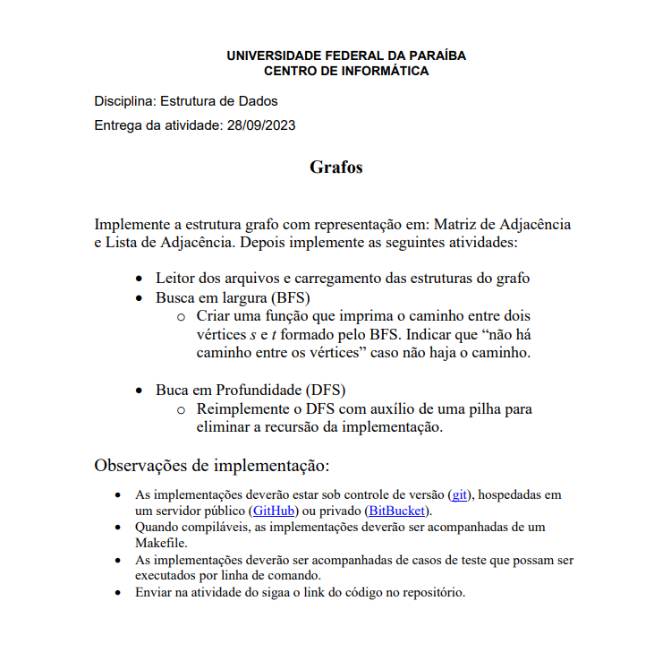

# Projeto de Grafos - Estrutura de Dados

Este é um projeto desenvolvido como parte da disciplina de Estrutura de Dados da Universidade Federal da Paraíba, do Centro de Informática.
O projeto se concentra na implementação da estrutura de grafo com representações em Matriz de Adjacência e Lista de Adjacência, juntamente com as seguintes funcionalidades:

- Leitura de arquivos e carregamento das estruturas do grafo.
- Busca em largura (BFS) para encontrar caminhos entre vértices.
- Busca em Profundidade (DFS) otimizada usando uma pilha para eliminar a recursão da implementação.

